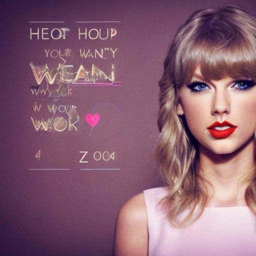

# lyrics_generation
The aim of the project is to build a model capable of generating lyrics in the style of Taylor Swift, given the first few verses of the song.

To find the optimal balance between model complexity and generation quality, we can consider two somewhat extreme cases. We chose [llama2-13b](https://huggingface.co/meta-llama/Llama-2-13b-chat-hf) as the first model that combines ease of use and high quality of generated texts. In particular, we have chosen an instructional version of the model. So our role in this case is to find the optimal prompt and generation settings. 

However, this model is quite slow and requires a large amount of memory. With this in mind, the second model we considered was the [T5 transformer](https://huggingface.co/t5-base). T5-base has only 220 million parameters and works quite fast. T5 was trained on a large number of different tasks, but unfortunately Taylor Swift lyrics generation was not one of them. Therefore, we fine-tuned the model on the song dataset. The quality is not as good as in the case of the llam2, but nevertheless, we can consider T5-base as a good starting point.

We also used DreamBooth to create possible album covers for some new songs

## Dataset processing
The original dataset consists of all of [Taylor Swift albums](https://www.kaggle.com/datasets/ishikajohari/taylor-swift-all-lyrics-30-albums). Taylor has many albums in which songs we know and love are given new arrangements. But the arrangements almost never affect the lyrics themselves. So it was necessary to find the same or almost the same songs to remove. In addition, some files contained extraneous metadata that also had to be removed. The dataset was cleaned using a script [preproc_data.py](preproc_data.py). The necessary methods can be found in the file [process_utils.py](process_utils.py)

## T5 and llama2 results
Full results are available in the folder [results](results). Let's take a look on some examples:
___
### Example 1
`Initial text:`
*[Verse 1]*
*Keep your helmet, keep your life, son*
*Just a flesh wound, here's your rifle*
*Crawling up the beaches now*
*"Sir, I think he's bleeding out"*
*And some things you just can't speak about*

*[Chorus]*
*With you I serve, with you I fall down, down*
*Watch you breathe in, watch you breathing out, out*

`T5:`
*And maybe the wound is bleeding out, son*
*"I have an air wound" [John 13:4]*
*The fire's going out... and all that you could tell me about it," I hear he*
*Look in, watch him breathing in, see your eyes wide, out, out*
*Your life is now saved by these hands*
*With you I fall down, withyou I fall again, not to say anything*
*Watch you breathe into, watch you breath inside, watch yourself breathing out,*

`llama2:`
*[Verse 1]*
*Keep your heart, keep your hope, son*
*We'll find a way to rise above*
*Chasing our dreams, we'll never stop*
*With you by my side, we're unstoppable*

*[Chorus]*
*With you I dream, with you I soar, up high*
*Together we'll rise, we'll touch the sky*
*Your love is my strength, my guiding light*
*With you I'll always take flight*

### Example 2
`Initial text:`
*[Verse 1]*
*We could leave the Christmas lights up 'til January*
*And this is our place, we make the rules*
*And there's a dazzling haze, a mysterious way about you, dear*
*Have I known you twenty seconds or twenty years?*
*[Chorus]*
*Can I go where you go?*
*Can we always be this close?*
*Forever and ever, ah*
*Take me out and take me home*
*You're my, my, my, my lover*

`T5:`
*we make the laws!*
*[Chorus]*
*Can I go where you go?*

*If only I can tell you how much it will change me before I get hurt*
*For ever and ever and always to whomever you ask for: "You're my lover."*
*There are, there's a little dust; there is a mystery about you.*

*Take me out and take me home... You're an eternal love that never dieth from me or anything*
*You see*

`llama2:`
_[Verse 2]_
*We could dance in the snow, and sing Christmas carols all night* 
*With our hearts beating fast, and our love shining bright* 
*And I'll never let go, I'll never let you go* 
*You're the only one who knows me like you do* 

_[Chorus]_
*Can I go where you go?* 
*Can we always be this close?* 
*Forever and ever, ah* 
*Take me out and take me home* 
*You're my, my, my, my lover* 
___
It can be seen that T5 tends to repeat the original text, but the model still shows some creativity. Llama2 gives quite good quality results. 

In this case, it is clear that the results of llama2 are significantly superior to those of T5. However, in the general case it is of course necessary to choose some metric for quantitative analysis. However, choosing a metric for the style transfer problem is a rather challenging but interesting task. It is possible to choose a metric based on n-gram matching or, for example, TF-IDF. It is also possible to build a classifier based, for example, on embeddings of Bert-type models. Bert itself could be pre-trained on target texts. 

## Album cover generation
For album cover generation we can use [DreamBooth](https://dreambooth.github.io/) technique. We have used the excellent [Notebook](https://github.com/ShivamShrirao/diffusers/tree/main/examples/dreambooth) provided by Shivam Shriraro. Here we have to tweak some parameters. It has been found by Reddit community that the best quality is achieved with the following parameters: 30 initial photos of the object (Taylor Swift), 1500 class images (photos of woman), 3000 training steps and 100 inference steps. We use standard token "zwx" as a unique identifier of Taylor Swift. The results can be found below:
`Prompt` *4K album cover with a photo of zwx woman. We could dance in the snow, and sing Christmas carols all night With our hearts beating fast, and our love shining bright*

  
   

`Prompt` *4K album cover with a photo of zwx woman. Keep your heart, keep your hope, son We'll find a way to rise above. Chasing our dreams*

  
   

`Prompt` *4K album cover with a photo of zwx woman. The tears I cried were like acid rain (Oh-oh, oh-oh)*

  
   

